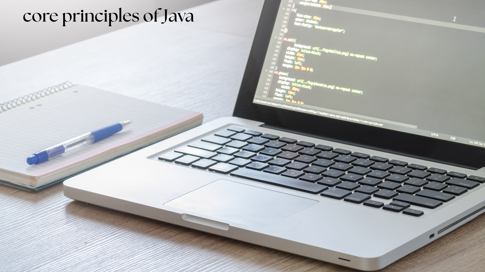

+++
date = 2025-05-20T07:07:07+01:00
draft = true
featured_image = "core.png" 
+++

# Core Principles of Java: The Foundation of a Timeless Programming Language

## Introduction

Java has remained a cornerstone of enterprise software development since its inception in 1995. Despite the rise of newer languages, Java continues to power mission-critical systems worldwide thanks to its robust design principles. Let's explore the fundamental concepts that make Java not just a language, but a comprehensive platform for building reliable applications.

## Write Once, Run Anywhere

Java's most celebrated principle is platform independence. The Java Virtual Machine (JVM) serves as an abstraction layer between code and hardware, allowing developers to write code on one system and run it on any platform with a compatible JVM installation.

public class HelloWorld {
    public static void main(String[] args) {
        System.out.println("Hello, World!");
    }
}

This simple program will run identically across Windows, macOS, Linux, and other platforms—something revolutionary when Java was first introduced.

# Object-Oriented Programming

Java was designed from the ground up as an object-oriented language. Everything in Java is an object (with some primitive exceptions), encouraging developers to think in terms of real-world entities with attributes and behaviors.

Core OOP concepts in Java include:

- **Encapsulation:** Wrapping data and methods into a single unit (class)